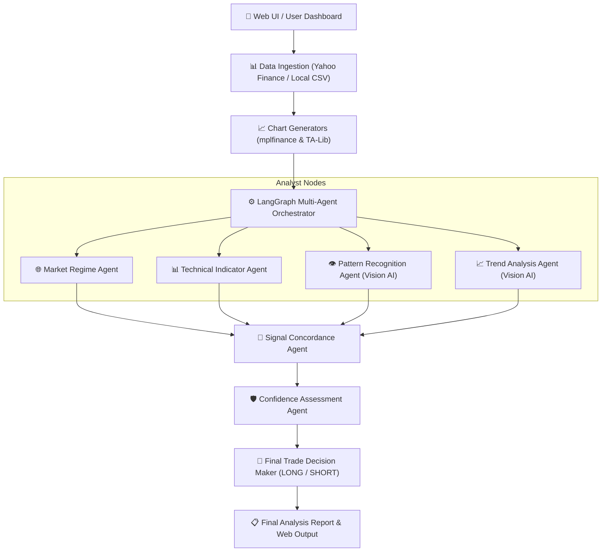

# OmniAgent: Multi-Agent Quantitative Trading System

OmniAgent is a sophisticated quantitative trading analysis platform that leverages the power of Large Language Models (LLMs) and LangGraph to perform multi-dimensional market analysis. By orchestrating specialized agents, OmniAgent provides comprehensive insights into technical indicators, chart patterns, and market trends to deliver actionable trading decisions.

## 🐳 One-Line Instant Launch (Docker)

Anyone anywhere on Earth can run OmniAgent with built-in Ollama & Vision Models out-of-the-box using a single command:

```bash
docker run -p 8080:8080 ghcr.io/the-raja/omniagent:latest
```

Once running, open **`http://localhost:8080`** in your browser! 🚀

## 🏗 System Architecture



## 🚀 Features

- **Multi-Agent Orchestration**: Built with **LangGraph**, the system utilizes a collaborative workflow of specialized agents:
  - **Market Regime Agent**: Evaluates macro environment context and overall market state.
  - **Indicator Agent**: Calculates and interprets key technical indicators (RSI, MACD, Stochastic, Williams %R, ROC) using TA-Lib.
  - **Pattern Agent**: Identifies and analyzes classic candlestick chart patterns using visual vision models and data-driven methods.
  - **Trend Agent**: Evaluates market momentum and structural support/resistance trendlines across multiple timeframes.
  - **Signal Concordance Agent**: Cross-checks agent reports to find signal alignment or flag conflicting indicators.
  - **Confidence Assessment Agent**: Evaluates multi-factor risk scores and outputs an overall confidence percentage.
  - **Decision Agent**: Synthesizes analysis from all agents to provide a final trade recommendation (**LONG** or **SHORT**) with dynamic risk/reward metrics.
- **Flexible LLM Integration**: Supports leading cloud & local AI providers:
  - **Ollama** (Local Vision Models: `llava`, `llama3.2-vision`, `qwen2.5-vl` — No API Key Required)
  - **OpenAI** (`gpt-4o`, `gpt-4o-mini`)
  - **Anthropic** (`claude-3-5-sonnet`, `claude-3-haiku`)
  - **Qwen** via DashScope (`qwen-max`, `qwen-vl-plus`)
- **Live & Historical Data**: 
  - Real-time data fetching via **Yahoo Finance**.
  - Local CSV benchmark support for backtesting and historical period analysis.
- **Interactive Web Interface**: A modern Flask-based dashboard for:
  - Configuring LLM providers and API keys.
  - Selecting assets (Crypto, Stocks, Forex, Indices).
  - Visualizing K-line charts and trend graphs.
  - Reviewing detailed agent reports and final trading decisions.

## 🛠 Tech Stack

- **Backend**: Python, Flask
- **AI/LLM**: LangChain, LangGraph, Ollama, OpenAI API, Anthropic API, DashScope (Qwen)
- **Data Analysis**: Pandas, NumPy, TA-Lib, yfinance
- **Visualization**: Matplotlib, mplfinance

## 📋 Prerequisites

- Python 3.9+
- [TA-Lib](https://github.com/mrjbq7/ta-lib) (Technical Analysis Library)
- [Ollama](https://ollama.com/) (Optional, for running local models like `llava`)
- API Key(s) for OpenAI, Anthropic, or Qwen (Optional, if using cloud providers)

## ⚙️ Installation

1. **Clone the repository**:
   ```bash
   git clone https://github.com/the-raja/OmniAgent.git
   cd OmniAgent
   ```

2. **Install dependencies**:
   ```bash
   pip install -r requirements.txt
   ```
   *Note: TA-Lib might require manual binary installation depending on your operating system.*

3. **Set up API Keys (Optional if using Ollama)**:
   You can set these as environment variables or configure them directly in the web interface settings.
   ```bash
   export OPENAI_API_KEY='your-key-here'
   # OR
   export ANTHROPIC_API_KEY='your-key-here'
   # OR
   export DASHSCOPE_API_KEY='your-key-here'
   ```

4. **Set up Ollama (Local Vision Model)**:
   ```bash
   ollama pull llava
   ollama serve
   ```

## 🚀 Usage

1. **Start the web interface**:
   ```bash
   python web_interface.py
   ```

2. **Access the dashboard**:
   Open your browser and navigate to `http://127.0.0.1:5000`.

3. **Run an Analysis**:
   - Select your preferred **LLM Provider** (e.g. `ollama`) in the settings.
   - Choose an **Asset** (e.g., BTC, SPX, AAPL).
   - Select the **Data Source** (Live or Local).
   - Click **Run Analysis** to initiate the multi-agent workflow.

## 📂 Project Structure

- `web_interface.py`: Main Flask application and API endpoints.
- `trading_graph.py`: Core orchestrator using LangChain and LangGraph.
- `*_agent.py`: Implementation of specialized analyst nodes.
- `graph_setup.py`: Definition of the LangGraph state machine workflow.
- `benchmark/`: Directory containing local CSV benchmark data for various assets.
- `templates/`: HTML templates for the web UI (`demo_new.html`, `output.html`).
- `static_util.py` & `graph_util.py`: Utility functions for technical calculations and chart generation.

---
*Disclaimer: OmniAgent is an analytical research tool and does not constitute financial advice. Trading involves significant risk.*
